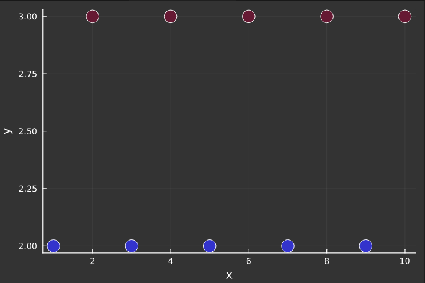
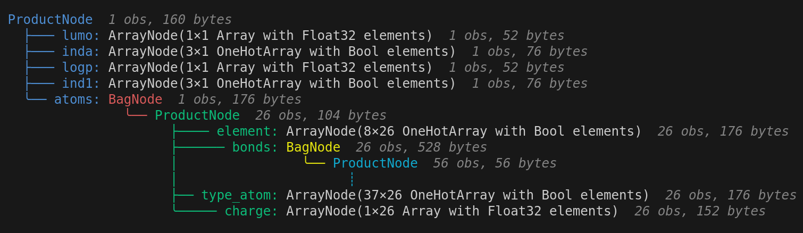
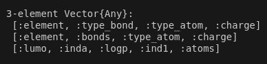

# 📦 HierarchicalMetric.jl

[](LICENSE)
[](https://your-docs-link)
[](https://github.com/kudlate1/HierarchicalMetric.jl/actions)

🚀 **HierarchicalMetric.jl** is a Julia package providing functions and scripts for the metric learning. 

## 🔍 **Introduction**

The metric learning is based on the distance between data points in a dataset. It can be used for many approaches in machine learning such as classification, clustering, or information retrieval. The distances for vector spaces are well known and relatively easy to define (e. g. euclidean, manhattan) in contrast to structured data. In this article, we introduce the theoretical foundations of metric learning in vector spaces and also examine learning with the Hierarchically-structured Tree Distance (HTD).

## 📚 **Approaches**

We are given fully labeled datasets, where we want to learn a sparse metric to separate two different classes using the triplet loss method. 

## 📌 **Tasks**

The task is to implement a training algorithm for learning a sparse metric. This process includes the iterative examination of the model parameters within a training loop. Parameter sparsity is achieved through the application of the Lasso regularization method.

The metric we are focusing on is called sparse, which means that not every parameter (or dimension) affects the computation of distances; therefore, some of the parameters can converges toward zero, which we want to show in the following examples.

### Example 1 ###

The first dataset is artificial and trivial, its main purpose is to graphically explain the theoretical foundations of the experiment.



### Example 2 ###

The second dataset called mutagenesis is significantly larger, its data points have a tree structure, so accordingly, more parameters to learn. 

Each node (molecule) contains 13 parameters describing chemical or physical properties of the molecule.



The parameters are recursively extracted from the inside out, thus we get a vector of parameter arrays, where each array represents one layer of parameters. 



## 🔧 **Instalation**
```julia
(@v1.10) pkg> add https://github.com/kudlate1/HierarchicalMetric.jl
```
## ⚙️ **Usage**

According to the mutagenesis dataset, the parameters can be analogically trained on any other dataset. For the training the fully labeled dataset is necessary (for n datapoints we need n labels of valid values).

### 1. Load dataset ###

The HierarchicalMetric package provides a function for loading the dataset, which includes transfering the nodes into wanted structure and extracting the labels.

```julia
# dataset X and labels y
X, y = load("julia/data/mutagenesis.json")
```
### 2. Pairwise distances ###

The precomputation of pairwise distances significantly acceelerates the training process. 

```julia
distances = pairwiseDistance(X)
```

### 3. Training ###

The training function returns the trained parameters 'ps' and the history of parameters 'h' during the training process, which is useful for the more elaborated plots.

```julia
# training with hard selection method
ps, h = train(SelectRandom(), X, y, distances; λ=0.2, max_iter=10);

# training with random selection method
ps, h = train(SelectHard(), X, y, distances; λ=0.2, max_iter=10);
```

### 4. Plots ###

The visualisation of the tree structured data might be challenging, but also beneficial for distinguish outlayers. The most straightforward way can be the heatmap representing the distances between nodes.

```julia
heatmap(distances, aspect_ratio = 1)
```

With an analysis of the trained parameters can be helpful to plot the process of learning.

```julia
# params of the function are the same as explained above
plotProcess(ps, h)
```

Sometimes the results of each training can slightly differ. For this case function paramsImportance(n) runs the learning n-times. Each finished training is decided wheather is a parameter important for calculations (+1) or not. The outcome is displayed on the graph.

```julia
# examine the parameters importance while n = 300 trainings
paramsImportance(300)
```